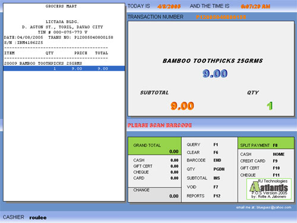



## Atlantis POS

### Description

The purpose of this program is to give POS programmers to have an idea on how POS works in a simplest GUI. This application is for Cashier only. If you need the manager's application just send me emails..tnxx..

god bless
 
### More Info
 
PLease send me comments if you wish too...

I hope this will help you

Please comment out the "Open port" commands and "printer #1, " command.

This line sends signals for printing the receipt and kicking-out the drawer.

             |
---                |---
**Submitted On**   |2005-04-10 22:44:38
**By**             |[rollie a\. jabonero](https://github.com/Planet-Source-Code/PSCIndex/blob/master/ByAuthor/rollie-a-jabonero.md)
**Level**          |Advanced
**User Rating**    |4.3 (115 globes from 27 users)
**Compatibility**  |VB 6\.0
**Category**       |[Complete Applications](https://github.com/Planet-Source-Code/PSCIndex/blob/master/ByCategory/complete-applications__1-27.md)
**World**          |[Visual Basic](https://github.com/Planet-Source-Code/PSCIndex/blob/master/ByWorld/visual-basic.md)
**Archive File**   |[Atlantis\_P1875104112005\.zip](https://github.com/Planet-Source-Code/rollie-a-jabonero-atlantis-pos__1-59888/archive/master.zip)

